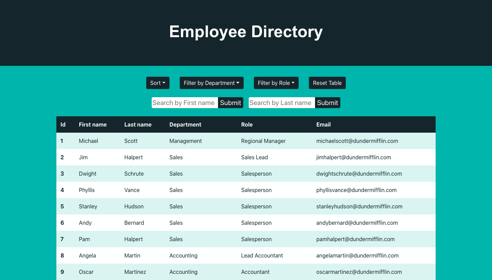
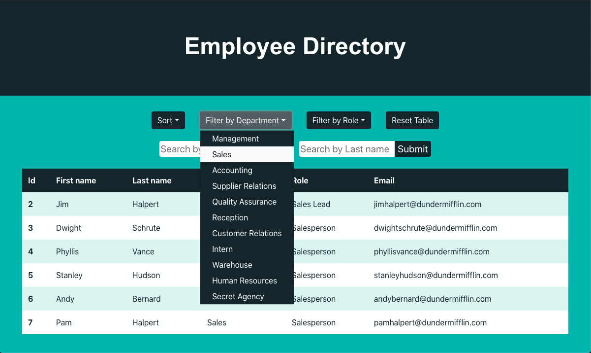
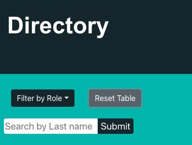

# react-employee-directory

This project was bootstrapped with [Create React App](https://github.com/facebook/create-react-app).

## About

The react-employee-directory uses dummy data in JSON format to populate an employee table. Users can sort, filter, and search the table using the dropdown buttons and search forms. To visit the deployed site, click this link: [https://dmabell693.github.io/react-employee-directory/](https://dmabell693.github.io/react-employee-directory/).

## Table of Contents

* [Usage](#Usage)
* [License](#License)
* [Contributing](#Contributing)
* [Tests](#Tests)
* [Questions](#Questions)

## Usage

## 

Users can choose which criteria they would like to use to find employees. Selecting the "Sort", "Filter by Department", or "Filter by Role" buttons will prompt a dropdown menu that displays sort or filter criterion.

The user should be informed that the "Sort" button will only filter the data that is presently on the table. For example, if the user filters the directory by the "Sales" department and then selects "Sort", the sales department alone will be sorted. If the user wants to sort the entire directory, they should first select "Reset Table".

## 

By selecting the "Reset Table" button, the user can completely reset the table.

## 

If the user would like to search for an employee by the employee's name, the user has the option of either searching by employee's first name or last name.

## 

## License

no license  

## Contributing

pull requests are welcome

## Tests

internal testing

## Questions
  Questions? Please contact me here:
  dmabell693@gmail.com
  And here is my face:
  ## 
